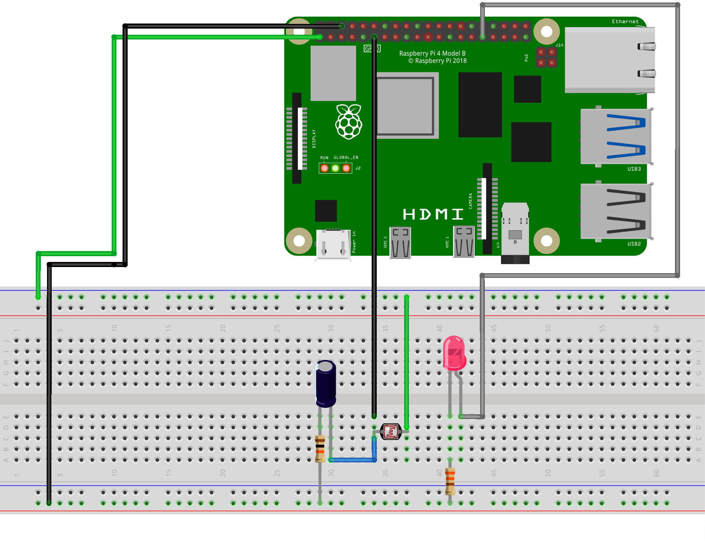

## LDR Light Detection with LED Control

This project uses a **Light Dependent Resistor (LDR)** connected to a **Raspberry Pi** to detect ambient light levels. Based on the light intensity, an **LED** is controlled. The LED will turn on when the light level exceeds a predefined threshold and turn off when the light level drops below it. 

## Features
- Measures ambient light using an LDR.
- Turns an LED on or off based on light levels.
- Includes a timeout warning for very dark environments.
- Python script running on Raspberry Pi.

## Hardware Required
- **Raspberry Pi** (any model with GPIO pins)
- **LDR (Light Dependent Resistor)**
- **LED** (any color)
- **330Ω Resistor** (for current limiting to LED)
- **10kΩ Resistor** (for voltage divider with LDR)
- **10µF Capacitor** (for stabilizing LDR readings)
- **Breadboard** and **jumper wires**
- **Power Supply** for Raspberry Pi

## Circuit Diagram

Below is the circuit diagram for connecting the LDR and LED to the Raspberry Pi:



## Setup

1. Connect the LDR to GPIO Pin 17 on the Raspberry Pi.
2. Connect the LED to GPIO Pin 6 on the Raspberry Pi.
3. Use a 330Ω resistor for the LED to limit the current and prevent damage to the GPIO pin.
4. Ensure the LDR is wired in a voltage divider configuration with a 10kΩ resistor and a 10µF capacitor to get a stable and readable voltage signal for light detection.

## Setup and Installation

1. **Prepare your Raspberry Pi**:
   - Enable **GPIO** on your Raspberry Pi (usually enabled by default).

2. **Hardware Setup**:
   - Connect the components according to the **circuit diagram** above. Make sure the LED and LDR are connected properly.

3. **Install Dependencies**:

   ```bash
   sudo apt-get update
   sudo apt-get install python3-rpi.gpio
   ```
   
4. Run the script:

    ```bash
    python3 LDRAmbient.py
    ```

## How It Works

The script works by reading the light level from the LDR using a GPIO pin (configured in the script). If the light level is above the defined threshold, the LED is turned on. If the light level falls below the threshold, the LED is turned off. The script will also display the current light level in the terminal and show a warning if the environment is too dark (when the sensor times out).
